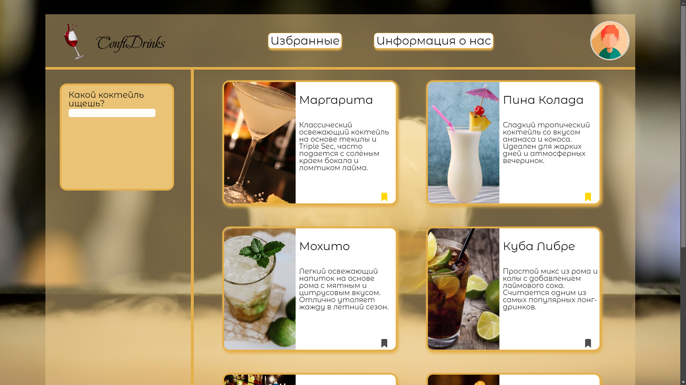

# ConfiDrinks

**ConfiDrinks** — это сайт, позволяющий искать коктейли, сохранять их в избранное и узнавать детальную информацию о каждом. Проект выполнен на HTML, CSS, JavaScript, с использованием локального JSON для данных о коктейлях.

## Возможности

- **Список коктейлей**: По умолчанию отображается часть карточек, затем можно нажать «Показать ещё» для подгрузки следующих.
- **Поиск**: Поле ввода, позволяющее фильтровать коктейли по названию или ингредиентам.
- **Избранное**: Отмечайте коктейли при помощи иконки (checkbox) — список избранных сохраняется в `localStorage`.
- **Детальная страница**: При клике на коктейль открывается страница с подробным описанием (данные из JSON).
- **Страница профиля**: Загрузка аватарки (локально) и ввод имени/фамилии, тоже через `localStorage`.
- **О нас**: Короткая страница с информацией о проекте.

## Структура проекта

- **index.html** — главная страница (список коктейлей, поиск).
- **cocktail.html** — детальная страница коктейля (через ID).
- **favorites.html** — избранное (из `localStorage`).
- **profile.html** — личный профиль.
- **about.html** — информация о проекте.
- **css/** — стили (header, layout, profile, и т.д.).
- **js/** — скрипты для каждой страницы (логика подгрузки JSON, localStorage, поиск).
- **js/cocktails.json** — база данных (названия, описания, ингредиенты, картинки ~30 коктейлей).

## Использование

- На главной (index.html) вы увидите карточки коктейлей.
- Нажмите “Показать ещё”, чтобы подгрузить следующие.
- Можно искать коктейли по названию или ингредиентам в поле поиска.
- Избранное: нажмите на иконку “закладки” (checkbox) — коктейль сохранится в локальном избранном. Перейдите на favorites.html, чтобы посмотреть выбранные коктейли.
- При клике на карточку откроется cocktail.html с детальной информацией (берётся из js/cocktails.json).
- В profile.html можно загрузить аватар, указать имя/фамилию — сохраняется в localStorage.
- В about.html — описание проекта, команда и контакты.

## Технологии

- **HTML5**, **CSS3**, **JavaScript (ES6+)**
- **LocalStorage** (для сохранения избранного и профиля)
- **Fetch** для подгрузки данных из JSON
- **Адаптив** через `@media` (верстка под разные экраны)

## Демо

[**Ссылка на GitHub Pages**](https://aasevastyanov.github.io/ConfiDrinks-project/)

## Идеи для развития

- Расширенный поиск: безалкогольные/крепкие/десертные.
- Регистрация/авторизация с реальным сервером (или mock API).
- Улучшение дизайна, анимаций карточек, плавное появление.
- Сохранение данных профиля на бэкенде при наличии сервера.

## Контакты

- **Автор**: Лёша (AASevastyanov)  
- [GitHub](https://github.com/AASevastyanov)

© 2025, ConfiDrinks. Все права защищены.
